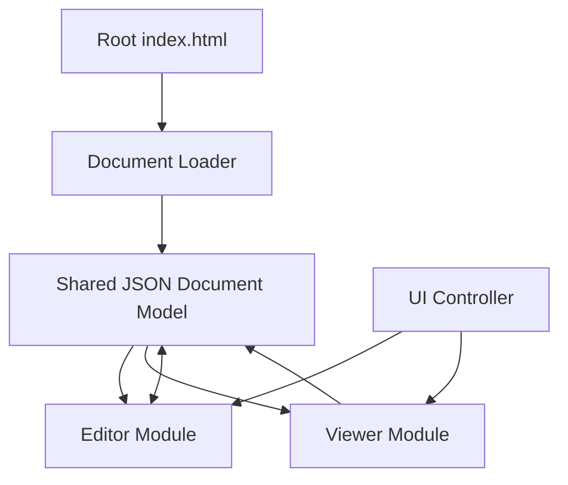

# Integration Plan for modeliNNg

This document outlines a plan for integrating the Editor and Viewer modules of the modeliNNg project into a unified application while maintaining their ability to function independently.

## Overview

The modeliNNg project consists of two main modules:

1. **Editor Module (StruML)**: A comprehensive environment for creating and editing structured JSON documents with hierarchical items, tags, and relationships.
2. **Viewer Module**: A streamlined interface for viewing and navigating the documents created with the editor.

The goal of this integration is to create a unified experience where users can seamlessly switch between editing and viewing modes while working with the same document in memory.

## Architecture

The integration will follow this high-level architecture:



### Key Components

1. **Root index.html**: The main entry point that provides access to both modules.
2. **Document Loader**: Handles loading JSON documents from files or URLs.
3. **Shared JSON Document Model**: Maintains the document state in memory, accessible to both modules.
4. **UI Controller**: Manages the interface and transitions between editor and viewer modes.

## Implementation Plan

### 1. Create the Root index.html

The root index.html will serve as a landing page and container for both modules:

```html
<!DOCTYPE html>
<html lang="en">
<head>
    <meta charset="UTF-8">
    <meta name="viewport" content="width=device-width, initial-scale=1.0">
    <title>modeliNNg - Structured Document Editor and Viewer</title>
    <link href="https://cdn.jsdelivr.net/npm/tailwindcss@2.2.19/dist/tailwind.min.css" rel="stylesheet">
    <style>
        .module-card {
            transition: transform 0.3s ease, box-shadow 0.3s ease;
        }
        .module-card:hover {
            transform: translateY(-5px);
            box-shadow: 0 10px 15px -3px rgba(0, 0, 0, 0.1), 0 4px 6px -2px rgba(0, 0, 0, 0.05);
        }
    </style>
</head>
<body class="bg-gray-100 min-h-screen">
    <div id="app" class="container mx-auto px-4 py-8">
        <!-- Header -->
        <header class="mb-8 text-center">
            <h1 class="text-4xl font-bold text-gray-800 mb-2">modeliNNg</h1>
            <p class="text-xl text-gray-600">Structured Document Editor and Viewer</p>
        </header>

        <!-- Module Selection -->
        <div class="grid md:grid-cols-2 gap-8 mb-12">
            <!-- Editor Card -->
            <div class="module-card bg-white rounded-lg shadow-md overflow-hidden">
                <div class="p-6">
                    <h2 class="text-2xl font-bold text-gray-800 mb-4">Editor Module</h2>
                    <p class="text-gray-600 mb-4">Create and edit structured documents with hierarchical items, tags, and relationships.</p>
                    <ul class="text-gray-600 mb-6 list-disc pl-5">
                        <li>Document management</li>
                        <li>Rich content editing</li>
                        <li>Tagging and filtering</li>
                        <li>Relation visualization</li>
                    </ul>
                    <div class="flex justify-between">
                        <a href="editor/index.html" class="bg-blue-600 text-white px-4 py-2 rounded hover:bg-blue-700">Open Editor</a>
                        <button id="loadToEditor" class="bg-gray-200 text-gray-800 px-4 py-2 rounded hover:bg-gray-300">Load Document</button>
                    </div>
                </div>
            </div>

            <!-- Viewer Card -->
            <div class="module-card bg-white rounded-lg shadow-md overflow-hidden">
                <div class="p-6">
                    <h2 class="text-2xl font-bold text-gray-800 mb-4">Viewer Module</h2>
                    <p class="text-gray-600 mb-4">Navigate and visualize structured documents in a streamlined interface.</p>
                    <ul class="text-gray-600 mb-6 list-disc pl-5">
                        <li>Tree-based navigation</li>
                        <li>Content display with Markdown</li>
                        <li>Tag and relation support</li>
                        <li>Export capabilities</li>
                    </ul>
                    <div class="flex justify-between">
                        <a href="viewer/index.html" class="bg-green-600 text-white px-4 py-2 rounded hover:bg-green-700">Open Viewer</a>
                        <button id="loadToViewer" class="bg-gray-200 text-gray-800 px-4 py-2 rounded hover:bg-gray-300">Load Document</button>
                    </div>
                </div>
            </div>
        </div>

        <!-- Integrated Experience -->
        <div class="bg-white rounded-lg shadow-md overflow-hidden p-6 mb-12">
            <h2 class="text-2xl font-bold text-gray-800 mb-4">Integrated Experience</h2>
            <p class="text-gray-600 mb-4">Work with both modules simultaneously, sharing the same document model.</p>
            <div class="flex justify-center">
                <button id="startIntegrated" class="bg-purple-600 text-white px-6 py-3 rounded hover:bg-purple-700">Launch Integrated Mode</button>
            </div>
        </div>

        <!-- File Input (Hidden) -->
        <input type="file" id="fileInput" accept=".json" style="display: none;">
    </div>

    <script src="js/integration.js"></script>
</body>
</html>
```

### 2. Create the Shared Document Model

Implement a shared document model that can be accessed by both modules:

```javascript
// js/documentModel.js
class DocumentModel {
    constructor() {
        this.document = null;
        this.listeners = [];
    }

    // Load document from JSON
    loadDocument(jsonData) {
        try {
            this.document = typeof jsonData === 'string' ? JSON.parse(jsonData) : jsonData;
            this.notifyListeners();
            return true;
        } catch (error) {
            console.error('Error loading document:', error);
            return false;
        }
    }

    // Get the current document
    getDocument() {
        return this.document;
    }

    // Update the document (from editor)
    updateDocument(newDocument) {
        this.document = newDocument;
        this.notifyListeners();
    }

    // Add a listener for document changes
    addListener(callback) {
        this.listeners.push(callback);
    }

    // Remove a listener
    removeListener(callback) {
        this.listeners = this.listeners.filter(listener => listener !== callback);
    }

    // Notify all listeners of document changes
    notifyListeners() {
        this.listeners.forEach(callback => callback(this.document));
    }
}

// Create a singleton instance
const documentModel = new DocumentModel();
export default documentModel;
```

### 3. Create the Integration Controller

Implement a controller to manage the integration between modules:

```javascript
// js/integration.js
import documentModel from './documentModel.js';

class IntegrationController {
    constructor() {
        this.editorFrame = null;
        this.viewerFrame = null;
        this.activeModule = null;
    }

    // Initialize the integrated mode
    initIntegratedMode() {
        // Create the layout
        this.createLayout();
        
        // Load the modules in iframes
        this.loadEditor();
        this.loadViewer();
        
        // Set up communication between frames
        this.setupCommunication();
    }

    // Create the layout for integrated mode
    createLayout() {
        const app = document.getElementById('app');
        app.innerHTML = `
            <div class="flex flex-col h-screen">
                <header class="bg-gray-800 text-white p-4 flex justify-between items-center">
                    <h1 class="text-xl font-bold">modeliNNg</h1>
                    <div class="flex space-x-4">
                        <button id="editorBtn" class="px-4 py-2 rounded bg-blue-600">Editor</button>
                        <button id="viewerBtn" class="px-4 py-2 rounded bg-gray-600">Viewer</button>
                        <button id="exitBtn" class="px-4 py-2 rounded bg-red-600">Exit</button>
                    </div>
                </header>
                <div class="flex-grow flex">
                    <div id="editorContainer" class="w-full h-full"></div>
                    <div id="viewerContainer" class="w-full h-full hidden"></div>
                </div>
            </div>
        `;

        // Add event listeners for buttons
        document.getElementById('editorBtn').addEventListener('click', () => this.switchToEditor());
        document.getElementById('viewerBtn').addEventListener('click', () => this.switchToViewer());
        document.getElementById('exitBtn').addEventListener('click', () => this.exitIntegratedMode());
    }

    // Load the editor in an iframe
    loadEditor() {
        const container = document.getElementById('editorContainer');
        this.editorFrame = document.createElement('iframe');
        this.editorFrame.src = 'editor/index.html';
        this.editorFrame.className = 'w-full h-full border-0';
        container.appendChild(this.editorFrame);
        this.activeModule = 'editor';
    }

    // Load the viewer in an iframe
    loadViewer() {
        const container = document.getElementById('viewerContainer');
        this.viewerFrame = document.createElement('iframe');
        this.viewerFrame.src = 'viewer/index.html';
        this.viewerFrame.className = 'w-full h-full border-0';
        container.appendChild(this.viewerFrame);
    }

    // Set up communication between frames
    setupCommunication() {
        window.addEventListener('message', (event) => {
            // Handle messages from editor or viewer
            if (event.data.type === 'documentUpdated') {
                documentModel.updateDocument(event.data.document);
            }
        });

        // Listen for document model changes
        documentModel.addListener((document) => {
            // Send updated document to both frames
            this.editorFrame.contentWindow.postMessage({
                type: 'documentUpdate',
                document: document
            }, '*');
            
            this.viewerFrame.contentWindow.postMessage({
                type: 'documentUpdate',
                document: document
            }, '*');
        });
    }

    // Switch to editor view
    switchToEditor() {
        document.getElementById('editorContainer').classList.remove('hidden');
        document.getElementById('viewerContainer').classList.add('hidden');
        document.getElementById('editorBtn').classList.replace('bg-gray-600', 'bg-blue-600');
        document.getElementById('viewerBtn').classList.replace('bg-green-600', 'bg-gray-600');
        this.activeModule = 'editor';
    }

    // Switch to viewer view
    switchToViewer() {
        document.getElementById('viewerContainer').classList.remove('hidden');
        document.getElementById('editorContainer').classList.add('hidden');
        document.getElementById('viewerBtn').classList.replace('bg-gray-600', 'bg-green-600');
        document.getElementById('editorBtn').classList.replace('bg-blue-600', 'bg-gray-600');
        this.activeModule = 'viewer';
    }

    // Exit integrated mode
    exitIntegratedMode() {
        window.location.href = 'index.html';
    }
}

// Initialize the controller
const controller = new IntegrationController();

// Event listeners for the landing page
document.addEventListener('DOMContentLoaded', () => {
    const fileInput = document.getElementById('fileInput');
    
    // Handle file selection
    fileInput.addEventListener('change', (event) => {
        const file = event.target.files[0];
        if (file) {
            const reader = new FileReader();
            reader.onload = (e) => {
                const jsonData = e.target.result;
                documentModel.loadDocument(jsonData);
                
                // Redirect based on the active button
                const activeButton = document.activeElement;
                if (activeButton.id === 'loadToEditor') {
                    window.location.href = 'editor/index.html';
                } else if (activeButton.id === 'loadToViewer') {
                    window.location.href = 'viewer/index.html';
                }
            };
            reader.readAsText(file);
        }
    });
    
    // Load to editor button
    document.getElementById('loadToEditor').addEventListener('click', () => {
        fileInput.click();
    });
    
    // Load to viewer button
    document.getElementById('loadToViewer').addEventListener('click', () => {
        fileInput.click();
    });
    
    // Start integrated mode button
    document.getElementById('startIntegrated').addEventListener('click', () => {
        controller.initIntegratedMode();
    });
});
```

### 4. Modify the Editor Module

Update the editor module to support integration:

1. Add message event listener to receive document updates from the integration controller
2. Send document updates to the parent window when changes are made
3. Implement a mechanism to load documents from the shared model

### 5. Modify the Viewer Module

Update the viewer module to support integration:

1. Add message event listener to receive document updates from the integration controller
2. Implement a mechanism to load documents from the shared model

## Implementation Considerations

### Local Storage Strategy

When operating in integrated mode:
- The document should be stored in the shared document model
- Local storage operations should be coordinated through the integration controller
- Each module should check if it's running in integrated mode before using its own local storage

### URL Parameters

The integration should support URL parameters for:
- Loading a specific document (`?document=path/to/document.json`)
- Starting in a specific mode (`?mode=editor` or `?mode=viewer`)
- Configuring the viewer (`?showSidebar=true`, etc.)

### Error Handling

Implement robust error handling for:
- Document loading failures
- Communication errors between modules
- Invalid document formats

## Future Enhancements

1. **Real-time Collaboration**: Add support for multiple users to edit the same document simultaneously.
2. **Version Control**: Implement document versioning and history tracking.
3. **Cloud Storage Integration**: Add support for saving and loading documents from cloud storage services.
4. **Custom Themes**: Allow users to customize the appearance of both modules.
5. **Plugin System**: Create a plugin architecture to extend functionality.

## Conclusion

This integration plan provides a framework for combining the Editor and Viewer modules into a unified application while maintaining their ability to function independently. By implementing a shared document model and communication mechanism, users will be able to seamlessly switch between editing and viewing modes while working with the same document.
